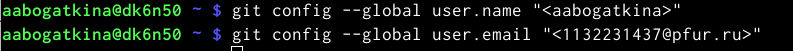
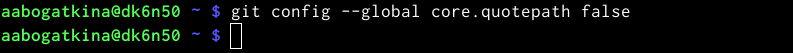

---
## Front matter
title: "Отчёт по лабораторной работе"
subtitle: "Лабораторная №2"
author: "Алёна Александровна Богаткина"

## Generic otions
lang: ru-RU
toc-title: "Содержание"

## Pdf output format
toc: true # Table of contents
toc-depth: 2
lof: true # List of figures
fontsize: 12pt
linestretch: 1.5
papersize: a4
documentclass: scrreprt
## I18n polyglossia
polyglossia-lang:
  name: russian
  options:
	- spelling=modern
	- babelshorthands=true
polyglossia-otherlangs:
  name: english
## I18n babel
babel-lang: russian
babel-otherlangs: english
## Fonts
mainfont: PT Serif
romanfont: PT Serif
sansfont: PT Sans
monofont: PT Mono
mainfontoptions: Ligatures=TeX
romanfontoptions: Ligatures=TeX
sansfontoptions: Ligatures=TeX,Scale=MatchLowercase
monofontoptions: Scale=MatchLowercase,Scale=0.9
## Biblatex
biblatex: true
biblio-style: "gost-numeric"
biblatexoptions:
  - parentracker=true
  - backend=biber
  - hyperref=auto
  - language=auto
  - autolang=other*
  - citestyle=gost-numeric
## Pandoc-crossref LaTeX customization
figureTitle: "Рис."
listingTitle: "Листинг"
lofTitle: "Список иллюстраций"
lolTitle: "Листинги"
## Misc options
indent: true
header-includes:
  - \usepackage{indentfirst}
  - \usepackage{float} # keep figures where there are in the text
  - \floatplacement{figure}{H} # keep figures where there are in the text
---

# Цель работы

Целью работы является изучить идеологию и применение средств контроля версий. Приобрести практические навыки по работе с системой git.

# Выполнение работы

## Базовая настройка git
Сначала делаем предварительную конфигурацию git. Открываем терминал и вводим следующие команды, указавываем имя и email владельца репозитория (рис. @fig:001).

{#fig:001 width=100%}

Настроим utf-8 в выводе сообщений git (рис. @fig:002).

{#fig:002 width=100%}

Зададим имя начальной ветки (будем называть её master), параметр autocrlf, параметр safecrlf (рис. @fig:003).

{#fig:003 width=100%} 

## Создание SSH ключа

Используя команду ‘ssh-keygen -C’, генерируем ключи (рис. @fig:004).

{#fig:004 width=100%}

Загружаем сгенерированный открытый ключ. С помощью команды ‘cat’ копируем из локальной консоли ключ в буфер обмена (рис. @fig:005).

{#fig:005 width=100%} 

Заходим на сайт github под своей учётной записью и переходим в «Setting», далее в «SSH and GPG keys» и нажимаем на кнопку «New SSH key».
Скопированный ключ вставляем в появившееся на сайте поле и указываем имя для ключа (Title) (рис. @fig:006).

{#fig:006 width=100%}

Проверяем себя(рис. @fig:007).

{#fig:007 width=100%} 

## Создание рабочего пространства и репозитория курса на основе шаблона

Используя ‘mkdir -p’ создаём каталог для предмета «Архитектура компьютера» и переходим в него с помощью команды ‘cd’. (рис. @fig:008).

{#fig:008 width=100%} 

Репозиторий на основе шаблона можно создать через web-интерфейс github. (рис. @fig:009).

{#fig:009 width=100%} 

Проверяем (рис. @fig:010).

{#fig:010 width=100%} 

Копируем ссылку на странице созданного репозитория (рис. @fig:011).

{#fig:011 width=100%}

Клонируем созданный репозиторий с помощью ‘git clone —recursive’ (рис. @fig:012).

{#fig:012 width=100%}

## Настройка каталога курса

Переходим в каталог курса и удаляем лишние файлы (рис. @fig:013).

{#fig:013 width=100%}

Создаём необходимые каталоги (рис. @fig:014).

{#fig:014 width=100%} 

Отправляем файлы на сервер с помощью команд ‘git add .’, ‘git commit -am’ и ‘git push’. (рис. @fig:015 и рис. @fig:016).

{#fig:015 width=100%} 

{#fig:016 width=100%}

Проверяем правильность создания иерархии рабочего пространства (рис. @fig:017 и рис. @fig:018).

{#fig:017 width=100%}

{#fig:018 width=100%}

# Задание для самостоятельной работы

Сделали отчёт по Лабораторной работе №1. Копируем его из каталога «Загрузки» в каталог «labs/lab01/report». Проверяем проделанные действия (рис. @fig:019).

{#fig:019 width=100%} 

Загружаем файл на github. Проверяем себя (рис. @fig:020).

{#fig:020 width=100%}  

# Вывод
В ходе лабораторной работы мы изучили идеологию и применение средств контроля версий. Также мы приобрели практические навыки по работе с системой git.
