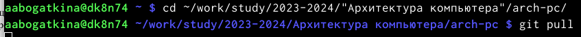
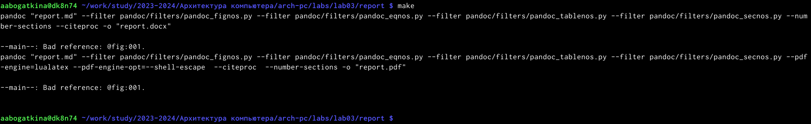
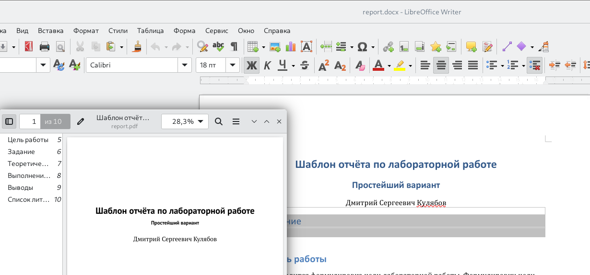
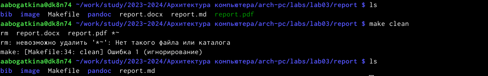
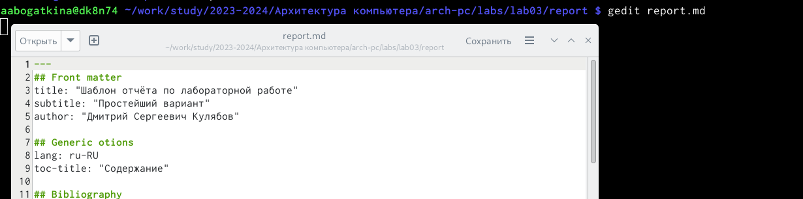
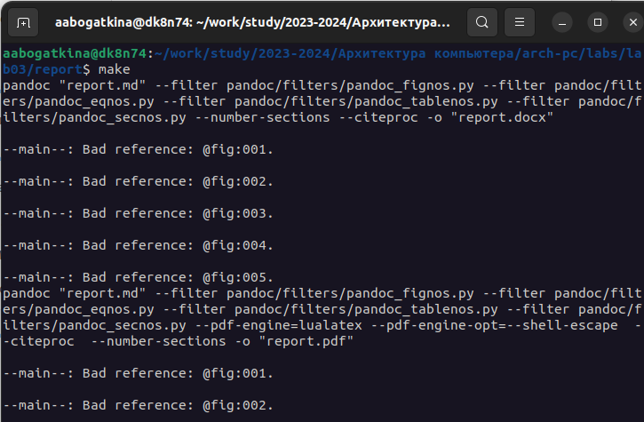
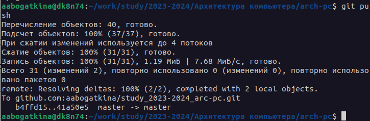
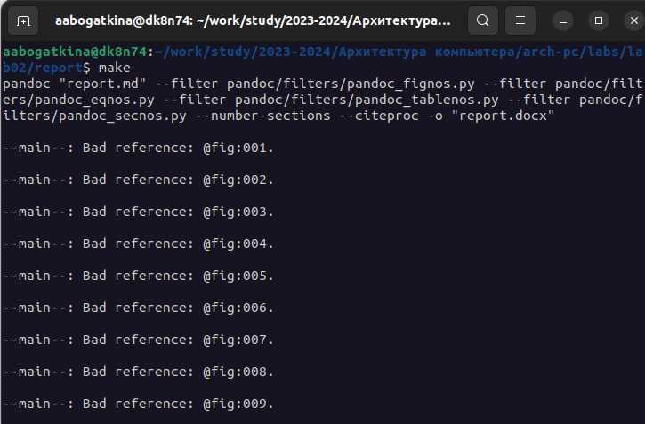
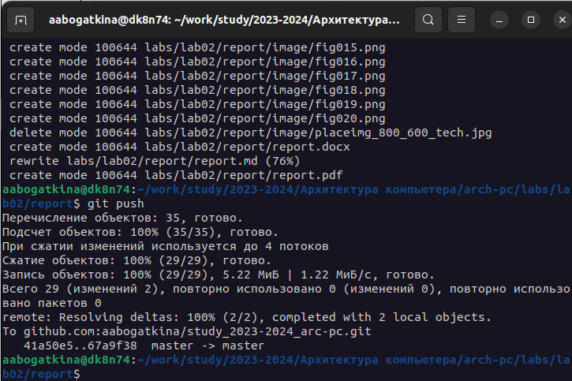

---
## Front matter
title: "Отчёт по лабораторной работе"
subtitle: "Лабораторная №3"
author: "Алёна Александровна Богаткина"

## Generic otions
lang: ru-RU
toc-title: "Содержание"

## Pdf output format
toc: true # Table of contents
toc-depth: 2
lof: true # List of figures
fontsize: 12pt
linestretch: 1.5
papersize: a4
documentclass: scrreprt
## I18n polyglossia
polyglossia-lang:
  name: russian
  options:
	- spelling=modern
	- babelshorthands=true
polyglossia-otherlangs:
  name: english
## I18n babel
babel-lang: russian
babel-otherlangs: english
## Fonts
mainfont: PT Serif
romanfont: PT Serif
sansfont: PT Sans
monofont: PT Mono
mainfontoptions: Ligatures=TeX
romanfontoptions: Ligatures=TeX
sansfontoptions: Ligatures=TeX,Scale=MatchLowercase
monofontoptions: Scale=MatchLowercase,Scale=0.9
## Biblatex
biblatex: true
biblio-style: "gost-numeric"
biblatexoptions:
  - parentracker=true
  - backend=biber
  - hyperref=auto
  - language=auto
  - autolang=other*
  - citestyle=gost-numeric
## Pandoc-crossref LaTeX customization
figureTitle: "Рис."
listingTitle: "Листинг"
lofTitle: "Список иллюстраций"
lolTitle: "Листинги"
## Misc options
indent: true
header-includes:
  - \usepackage{indentfirst}
  - \usepackage{float} # keep figures where there are in the text
  - \floatplacement{figure}{H} # keep figures where there are in the text
---

# Цель работы

Целью работы является освоение процедуры оформления отчетов с помощью легковесного языка разметки Markdown.

# Выполнение работы

**Задание №1.** Открыть терминал. Перейти в каталог курса сформированный при выполнении лабораторной работы. Обновить локальный репозиторий, скачав изменения из удаленного репозитория с помощью команды git pull.

Я открыла терминал и перешла в каталог ~/work/study/2023-2024/"Архитектура компьютера"/arch-pc/ с помощью  cd. И обновила локальный репозиторий с помощью git pull (рис. @fig:001).

{#fig:001 width=100%}

**Задание №2.** Перейти в каталог с шаблоном отчета по лабораторной работе № 3. Провести компиляцию шаблона с использованием Makefile. Для этого ввести команду make. Открыть и проверить корректность полученных файлов.

Я перешла в каталог ~/work/study/2023-2024/"Архитектура компьютера"/arch-pc/labs/lab03/report с помощью cd и провела компиляцию шаблона с использованием Makefile, введя команду make (рис. @fig:002).

{#fig:002 width=100%}

Я открыла и проверила корректность полученных файлов (рис. @fig:003).

{#fig:003 width=100%}

**Задание №4.** Удалить полученные файлы с использованием Makefile. Для этого ввести команду make clean. Проверить, что после этой команды файлы report.pdf и report.docx были удалены.

Я удалила полученные файлы с использованием Makefile, введя make clean и проверила, что после этой команды файлы report.pdf и report.docx были удалены (рис. @fig:004).

{#fig:004 width=100%}

**Задание №5.** Открыть файл report.md c помощью любого текстового редактора, например gedit. Внимательно изучить структуру этого файла.

Я открыла файл report.md c помощью gedit report.md (рис. @fig:005).

{#fig:005 width=100%}

Я внимательно изучила структуру этого файла.

**Задание №6.** Заполнить отчет и скомпилировать отчет с использованием Makefile. Проверить корректность полученных файлов. 

Я заполнила отчёт и скомпилировала отчет с использованием Makefile. После ввода команды make создаются необходимые файлы, я проверила корректность полученных файлов (рис. @fig:006).

{#fig:006 width=100%}

**Задание №7.** Загрузить файлы на Github. 

Я загрузила файлы на Github с помощью приведённых команд (рис. @fig:007).

{#fig:007 width=100%}

# Выполнение самостоятельной работы

**Задание №1.** В соответствующем каталоге сделать отчёт по лабораторной работе № 2 в формате Markdown. В качестве отчёта необходимо предоставить отчёты в 3 форматах: pdf, docx и md.

В каталоге ~/work/study/2023-2024/"Архитектура компьютера"/arch-pc/labs/lab02/report я сделала отчёт по лабораторной работе № 2 в формате Markdown. И с помощью Makefile скомпилировала отчёт в форматах pdf и docx (рис. @fig:008).

{#fig:008 width=100%}

**Задание №2.** Загрузить файлы на Github.

Я загрузила файлы на Github с помощью приведённых команд (рис. @fig:009).

{#fig:009 width=100%}

# Выводы

Я освоила процедуры оформления отчетов с помощью легковесного языка разметки Markdown.
