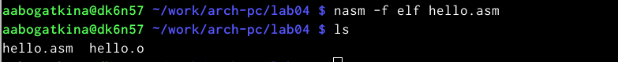

---
## Front matter
title: "Отчёт по лабораторной работе"
subtitle: "Лабораторная №4"
author: "Алёна Александровна Богаткина"

## Generic otions
lang: ru-RU
toc-title: "Содержание"

## Pdf output format
toc: true # Table of contents
toc-depth: 2
lof: true # List of figures
fontsize: 12pt
linestretch: 1.5
papersize: a4
documentclass: scrreprt
## I18n polyglossia
polyglossia-lang:
  name: russian
  options:
	- spelling=modern
	- babelshorthands=true
polyglossia-otherlangs:
  name: english
## I18n babel
babel-lang: russian
babel-otherlangs: english
## Fonts
mainfont: PT Serif
romanfont: PT Serif
sansfont: PT Sans
monofont: PT Mono
mainfontoptions: Ligatures=TeX
romanfontoptions: Ligatures=TeX
sansfontoptions: Ligatures=TeX,Scale=MatchLowercase
monofontoptions: Scale=MatchLowercase,Scale=0.9
## Biblatex
biblatex: true
biblio-style: "gost-numeric"
biblatexoptions:
  - parentracker=true
  - backend=biber
  - hyperref=auto
  - language=auto
  - autolang=other*
  - citestyle=gost-numeric
## Pandoc-crossref LaTeX customization
figureTitle: "Рис."
listingTitle: "Листинг"
lofTitle: "Список иллюстраций"
lolTitle: "Листинги"
## Misc options
indent: true
header-includes:
  - \usepackage{indentfirst}
  - \usepackage{float} # keep figures where there are in the text
  - \floatplacement{figure}{H} # keep figures where there are in the text
---

# Цель работы

Освоение процедуры компиляции и сборки программ, написанных на ассемблере NASM.

# Выполнение работы

**Задание №1.** Создать каталог для работы с программами на языке ассемблера NASM: mkdir -p ~/work/arch-pc/lab04. Перейти в созданный каталог.

Я создала каталог и перешла в него (рис. @fig:001).

{#fig:001 width=100%}

**Задание №2.** Создать текстовый файл с именем hello.asm. Открыть этот файл с помощью любого текстового редактора, например, gedit, и ввести в него необходимый текст.

Я создала текстовый файл и открыла с помощью gedit, ввела необходимый текст (рис. @fig:002).

{#fig:002 width=100%}

**Задание №3.** Скомпилировать текст программы из файла hello.asm и проверить, что был создан объектный файл. Какое имя имеет объектный файл?

Я скомпилировала текст программы и проверила, что  файл был создан с помощью ls. Он называется так же, как и компилируемый файл hello(.o) (рис. @fig:003).

{#fig:003 width=100%}

**Задание №4.** Ввести команду nasm -o obj.o -f elf -g -l list.lst hello.asm, которая скомпилирует исходный файл hello.asm в obj.o (опция -o позволяет
задать имя объектного файла, в данном случае obj.o), при этом формат выходного файла будет elf, и в него будут включены символы для отладки (опция -g), кроме того, будет создан файл листинга list.lst (опция -l). Проверить, что файлы были созданы. 

Я ввела необходимую команду и проверила, что файлы list.lst и obj.o были созданы (рис. @fig:004).

{#fig:004 width=100%}

**Задание №5.** Передать объектный файл на обработку компоновщика. Проверить, что исполняемый файл hello был создан.

Я передала объектный файл с помощью команды ld -m elf_i386 hello.o -o hello и проверила, что исполняемый файл hello был создан (рис. @fig:005).

{#fig:005 width=100%}

**Задание №6.** Выполните следующую команду: ld -m elf_i386 obj.o -o main

Какое имя будет иметь исполняемый файл? Какое имя имеет объектный файл из которого собран этот исполняемый файл?

Я выполнила предложенную команду и посмотрела, какой файл был создан, с помощью ls (рис. @fig:006).

{#fig:006 width=100%}

Исполняемый файл имеет имя main. Оно задано в конце команды. Исполняемый файл собран из объектного файла obj.o.

**Задание №7.** Запустить на выполнение созданный исполняемый файл, находящийся в текущем каталоге.

Я запустила на выполнение созданный исполняемый файл hello (рис. @fig:007).

{#fig:007 width=100%}

# Выполнение самостоятельной работы

**Задание №1.** В каталоге ~/work/arch-pc/lab04 с помощью команды cp создайте копию файла hello.asm с именем lab4.asm. С помощью любого текстового редактора внесите изменения в текст программы в файле lab4.asm так, чтобы вместо *Hello world!* на экран выводилась строка с вашими фамилией и именем.

Я создала копию файла hello.asm с именем lab4.asm, открыла его и изменила, чтобы выводилась строка с моим ФИО (рис. @fig:008).

{#fig:008 width=100%}

**Задание №2.** Оттранслировать полученный текст программы lab4.asm в объектный файл. Выполните компоновку объектного файла и запустите получившийся исполняемый файл.

Я оттранслировала полученный текст программы lab4.asm в объектный файл. Затем я выполнила компоновку объектного файла и запустила получившийся исполняемый файл (рис. @fig:009).

{#fig:009 width=100%}

**Задание №3.** Скопируйте файлы hello.asm и lab4.asm в Ваш локальный репозиторий в каталог ~/work/study/2023-2024/"Архитектура компьютера"/arch-pc/labs/lab04/. Загрузите файлы на Github.

С помощью команды cp я скопировала файлы hello.asm и lab4.asm в мой локальный репозиторий в каталог ~/work/study/2023-2024/"Архитектура компьютера"/arch-pc/labs/lab04/. Затем загрузила файлы на гитхаб (рис. @fig:010).

{#fig:010 width=100%}

# Выводы
Я освоила процедуры компиляции и сборки программ, написанных на ассемблере NASM.
