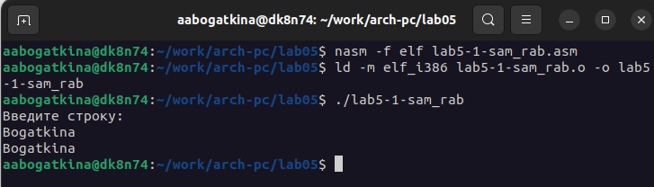

---
## Front matter
title: "Отчёт по лабораторной работе"
subtitle: "Лабораторная №5"
author: "Алёна Александровна Богаткина"

## Generic otions
lang: ru-RU
toc-title: "Содержание"

## Pdf output format
toc: true # Table of contents
toc-depth: 2
lof: true # List of figures
fontsize: 12pt
linestretch: 1.5
papersize: a4
documentclass: scrreprt
## I18n polyglossia
polyglossia-lang:
  name: russian
  options:
	- spelling=modern
	- babelshorthands=true
polyglossia-otherlangs:
  name: english
## I18n babel
babel-lang: russian
babel-otherlangs: english
## Fonts
mainfont: PT Serif
romanfont: PT Serif
sansfont: PT Sans
monofont: PT Mono
mainfontoptions: Ligatures=TeX
romanfontoptions: Ligatures=TeX
sansfontoptions: Ligatures=TeX,Scale=MatchLowercase
monofontoptions: Scale=MatchLowercase,Scale=0.9
## Biblatex
biblatex: true
biblio-style: "gost-numeric"
biblatexoptions:
  - parentracker=true
  - backend=biber
  - hyperref=auto
  - language=auto
  - autolang=other*
  - citestyle=gost-numeric
## Pandoc-crossref LaTeX customization
figureTitle: "Рис."
listingTitle: "Листинг"
lofTitle: "Список иллюстраций"
lolTitle: "Листинги"
## Misc options
indent: true
header-includes:
  - \usepackage{indentfirst}
  - \usepackage{float} # keep figures where there are in the text
  - \floatplacement{figure}{H} # keep figures where there are in the text
---

# Цель работы

Приобретение практических навыков работы в Midnight Commander. Освоение инструкций языка ассемблера mov и int.

# Выполнение работы

**Задание №1.** Откройте Midnight Commander. Пользуясь стрелочками и клавишей Enter перейдите в каталог ~/work/arch-pc созданный при выполнении лабораторной работы №4. С помощью функциональной клавиши F7 создайте папку lab05. 

Я открыла Midnight Commander с помощью команды mc, перешла в cозданный каталог ~/work/arch-pc, используя управение, создала папку с именем lab05 с помощью функциональной клавиши F7 (рис. @fig:001).

{#fig:001 width=100%}

**Задание №2.** Перейдите в каталог. Пользуясь строкой ввода и командой touch создайте файл lab5-1.asm.

Я перешла в каталог и создала файл lab5-1.asm (рис. @fig:002).

{#fig:002 width=100%}

**Задание №3.** С помощью функциональной клавиши F4 откройте файл lab5-1.asm для редактирования во встроенном редакторе. Введите текст программы из листинга 5.1 (можно без комментариев), сохраните изменения и закройте файл. 

С помощью функциональной клавиши F4 я открыла файл lab5-1.asm в редакторе nano и ввела текст программы (рис. @fig:003).

{#fig:003 width=100%}

Я сохранила изменения и закрыла файл.

**Задание №4.** С помощью функциональной клавиши F3 откройте файл lab5-1.asm для просмотра. Убедитесь, что файл содержит текст программы.

С помощью функциональной клавиши F3 я открыла файл lab5-1.asm для просмотра и убедилась, что файл содержит текст программы (рис. @fig:004).

{#fig:004 width=100%}

**Задание №5.** Оттранслируйте текст программы lab5-1.asm в объектный файл. Выполните компоновку объектного файла и запустите получившийся исполняемый файл. Программа выводит строку 'Введите строку:' и ожидает ввода с клавиатуры. На запрос введите Ваши ФИО.

Я оттранслировала файл lab5-1.asm в объектный файл, выполнила компанувку объектного файла и запустила получившийся исполняемый файл. В терминале появилась строка "Введите строку:". Я ввела свои имя и фамилию (рис. @fig:005).

{#fig:005 width=100%}

**Задание №6.** В одной из панелей mc откройте каталог с файлом lab5-1.asm. В другой панели каталог со скаченным файлом in_out.asm (для перемещения между панелями используйте Tab). Скопируйте файл in_out.asm в каталог с файлом lab5-1.asm.

Открыв в одной панеле каталог с файлом lab5-1.asm, а в другой каталог "Загрузки" со скаченным файлом in_out.asm, я переместила in_out.asm с помощью функциональной клавиши (рис. @fig:006).

{#fig:006 width=100%}

**Задание №7.**  С помощью функциональной клавиши создайте копию файла lab5-1.asm с именем lab5-2.asm.

С помощью функциональной клавиши я создала копию файла lab5-1.asm с именем lab5-2.asm (рис. @fig:007).

{#fig:007 width=100%}

**Задание №8.** Исправьте текст программы в файле lab5-2.asm с использование подпрограмм из внешнего файла in_out.asm (используйте подпрограммы sprintLF, sread и quit) в соответствии с листингом 5.2. Создайте исполняемый файл и проверьте его работу.

Я исправила текст программы в lab5-2.asm с использование подпрограмм из внешнего файла in_out.asm (использовала подпрограммы sprintLF, sread и quit) в соответствии с листингом 5.2. Создала исполняемый файл и проверила его работу (рис. @fig:008).

{#fig:008 width=100%}

**Задание №9.** В файле lab5-2.asm замените подпрограмму sprintLF на sprint. Создайте исполняемый файл и проверьте его работу. В чем разница?

Я заменила подпрограмму sprintLF на sprint. Создала исполняемый файл и проверила его работу (рис. @fig:009).

{#fig:009 width=100%}

Разница в отсутствии переноса строки.

# Выполнение самостоятельной работы

**Задание №1.** Создайте копию файла lab5-1.asm. Внесите изменения в программу (без использования внешнего файла in_out.asm), так чтобы она работала по следующему алгоритму:

• вывести приглашение типа “Введите строку:”;

• ввести строку с клавиатуры;

• вывести введённую строку на экран.

Получите исполняемый файл и проверьте его работу. На приглашение ввести строку введите свою фамилию.

С помощью функциональной клавиши F5 я создала копию файла lab5-1.asm с именем lab5-1-sam_rab.asm и добавила в неё часть кода, чтобы программа выводила строку, введённую с клавиатуры. Я создала исполняемый файл и проверила его работу (рис. @fig:010).

{#fig:010 width=100%}

**Задание №2.** Создайте копию файла lab5-2.asm. Исправьте текст программы с использование подпрограмм из внешнего файла in_out.asm, так чтобы она работала по следующему алгоритму:

• вывести приглашение типа “Введите строку:”;

• ввести строку с клавиатуры;

• вывести введённую строку на экран.

Создайте исполняемый файл и проверьте его работу.

С помощью функциональной клавиши F5 я создала копию файла lab5-2.asm с именем lab5-2-sam_rab.asm и исправила текст программы, добавив подпрограмму sprintLF для вывода введённой строки (на новой строке). Я создала исполняемый файл и проверила работу программы (рис. @fig:011).

{#fig:011 width=100%}

# Выводы
Я приобрела практические навыки работы в Midnight Commander.
