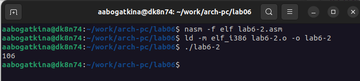

---
## Front matter
title: "Отчёт по лабораторной работе"
subtitle: "Лабораторная №6"
author: "Алёна Александровна Богаткина"

## Generic otions
lang: ru-RU
toc-title: "Содержание"

## Pdf output format
toc: true # Table of contents
toc-depth: 2
lof: true # List of figures
fontsize: 12pt
linestretch: 1.5
papersize: a4
documentclass: scrreprt
## I18n polyglossia
polyglossia-lang:
  name: russian
  options:
	- spelling=modern
	- babelshorthands=true
polyglossia-otherlangs:
  name: english
## I18n babel
babel-lang: russian
babel-otherlangs: english
## Fonts
mainfont: PT Serif
romanfont: PT Serif
sansfont: PT Sans
monofont: PT Mono
mainfontoptions: Ligatures=TeX
romanfontoptions: Ligatures=TeX
sansfontoptions: Ligatures=TeX,Scale=MatchLowercase
monofontoptions: Scale=MatchLowercase,Scale=0.9
## Biblatex
biblatex: true
biblio-style: "gost-numeric"
biblatexoptions:
  - parentracker=true
  - backend=biber
  - hyperref=auto
  - language=auto
  - autolang=other*
  - citestyle=gost-numeric
## Pandoc-crossref LaTeX customization
figureTitle: "Рис."
listingTitle: "Листинг"
lofTitle: "Список иллюстраций"
lolTitle: "Листинги"
## Misc options
indent: true
header-includes:
  - \usepackage{indentfirst}
  - \usepackage{float} # keep figures where there are in the text
  - \floatplacement{figure}{H} # keep figures where there are in the text
---

# Цель работы

Освоение арифметических инструкций языка ассемблера NASM.

# Выполнение работы

**Задание №1.** Создайте каталог для программ лабораторной работы № 6, перейдите в него и создайте файл lab6-1.asm.

Я создала каталог lab06, затем перешла в него с помощью и создала файл lab6-1.asm (рис. @fig:001).

{#fig:001 width=100%}

**Задание №2.** Введите в файл lab6-1.asm текст программы из листинга 6.1. Создайте исполняемый файл и запустите его.

Я ввела в файл текст программы из листинга 6.1. Я создала исполняемый файл и запустила его (рис. @fig:002).

{#fig:002 width=100%}

На (рис. @fig:002) видно, что программа вывела символ "j", как и описано руководстве по выполнению лабораторной работы №6. Это происходит из-за того, что мы вводим символы '6' и '4', которые в десятичном представлении имеют коды 54 и 52 соответственно. Поэтому при сложении получается код 106, который соответствует по таблице ASCII символу 'j'.

**Задание №3.** Измените текст программы и вместо символов запишите в регистры числа. Создайте исполняемый файл и запустите его. Пользуясь таблицей ASCII определите какому символу соответствует код 10 (который получается при сложении). Отображается ли этот символ при выводе на экран?

Я изменила текст программы и вместо символов записала в регистры числа. Я создала исполняемый файл и запустила его, получив следующий результат (рис. @fig:003).

{#fig:003 width=100%}

По таблице ASCII код 10 имеет символ "LF, \\n", то есть перенос строки.  На (рис. @fig:003) видно, что действительно результатом программы является перенос строки, то есть символ отображается.  

**Задание №4.** Преобразовать текст программы из Листинга 6.1 с использованием подпрограмм для преобразования ASCII символов в числа и обратно из файла in_out.asm. Создайте файл lab6-2.asm в каталоге ~/work/arch-pc/lab06 и введите в него текст программы из листинга 6.2. Создайте исполняемый файл и запустите его.

Я создала файл lab6-2.asm и ввела в файл текст программы из листинга 6.2. Я создала исполняемый файл и запустила его (рис. @fig:004).

{#fig:004 width=100%}

Программа вывела 106, сложив коды символов '6' и '4', как в программе из задания 1. Однако, благодаря функции iprintLF, выводится не символ 'j', чьим кодом является 106, а число 106.

**Задание №5.** Аналогично предыдущему примеру измените символы на числа. Создайте исполняемый файл и запустите его. Какой результат будет получен при исполнении программы? Замените функцию iprintLF на iprint. Создайте исполняемый файл и запустите его. Чем отличается вывод функций iprintLF и iprint?

Аналогично предыдущему примеру я изменила символы на числа. Создала исполняемый файл и запустила его. Программа выдала в ответ 10, тот ответ, который мы и хотели получить (рис. @fig:005).

{#fig:005 width=100%}

Аналогично предыдущему примеру мы получаем 10 при сложении 6 и 4, но теперь благодаря функции iprintLF, выводится не соответствующий коду символ, а само число 10.

Я заменила функцию iprintLF на iprint. Я создала исполняемый файл и запустила его (рис. @fig:006).

{#fig:006 width=100%}

Как можно видеть на (рис. @fig:006) результат получен такой же, но отличие в отсутствии перевода строки после результата. 

**Задание №6.** В качестве примера выполнения арифметических операций в NASM приводится программа вычисления арифметического выражения f(x) = (5 * 2 + 3)/3. Создайте файл lab6-3.asm в каталоге ~/work/arch-pc/lab06. Внимательно изучите текст программы из листинга 6.3 и введите в lab6-3.asm. Создайте исполняемый файл и запустите его.

Я создала файл lab6-3.asm. Внимательно изучила текст программы из листинга 6.3 и ввела его в lab6-3.asm. Я создала исполняемый файл и запустила его (рис. @fig:007).

{#fig:007 width=100%}

На (рис. @fig:007) видно, что программа выдаёт необходимый результат.

**Задание №7.** Измените текст программы для вычисления выражения f(x) = (4 * 6 + 2)/5. Создайте исполняемый файл и проверьте его работу.

Я изменила текст программы для вычисления новой функции. Так как функция идентична функции из предыдущего задания, необходимо только заменить числа в предыдущей программе на данные.

После изменения кода, я создала исполняемый файл и проверила его работу (рис. @fig:008).

{#fig:008 width=100%}

Программа выдаёт результат 5 и остаток 1. Программа выдает верный результат.

**Задание №9.** Создайте файл variant.asm в каталоге ~/work/arch-pc/lab06. Внимательно изучите текст программы из листинга 6.4 и введите в файл variant.asm. Создайте исполняемый файл и запустите его. Проверьте результат работы программы, вычислив номер варианта аналитически.

Включите в отчет по выполнению лабораторной работы ответы на вопросы.

Я создала файл variant.asm. Внимательно изучила текст программы из листинга 6.4 и ввела в файл. Затем я создала исполняемый файл и запустила его (рис. @fig:009).

{#fig:009 width=100%}

Я ввела номер своего студенческого билета — 1132231437. Моим вариантом программа вывела 18. 

Ответы на вопросы:

**1. Какие строки листинга 6.4 отвечают за вывод на экран сообщения ‘Ваш вариант:’?**

Строки

mov eax,rem

call sprint

В rem записано необходимое сообщение, чтобы функция вывода правильно работала, необходимо переместить значение rem в eax. Функция sprint — функция вывода **сообщения** на экран.  

**2. Для чего используется следующие инструкции?**

**mov ecx, x**

**mov edx, 80**

**call sread**

Приведённые инструкции используются для ввода сообщения с клавиатуры. Переменная x — буфер размером 80 байт. Сначала мы записываем его в регистр, чтобы передать адрес переменной, в которую будет записано введенное сообщение. Второй строчкой введена длина строки. Третья — вызов подпрограммы, которая считывает сообщение с клавиатуры. 

**3. Для чего используется инструкция “call atoi”?**

Эта функция преобразует ascii-код символа в целое число.

**4. Какие строки листинга 6.4 отвечают за вычисления варианта?**

Строки

xor edx,edx

mov ebx,20

div ebx

inc edx

Первой строчкой обнуляем EDX для корректной работы div. Второй присваиваем EBX значение 20 (наш делитель). Третьей делим EAX (в котором находится номер студенческого билета после использования функции atoi) на EBX (то есть на 20). Остаток записывается в регистр EDX. Последняя строчка прибавляет к EDX единицу.

**5. В какой регистр записывается остаток от деления при выполнении инструкции “div ebx”?**

Остаток от деления записывается в регистр EDX, поэтому единица прибавляется именно к EDX (inc edx).

**6. Для чего используется инструкция “inc edx”?**

Инструкция inc edx прибавляет к остатку, записанному в EDX, единицу.

**7. Какие строки листинга 6.4 отвечают за вывод на экран результата вычислений?**

Строки

mov eax,rem

call sprint

mov eax,edx

call iprintLF

Про вывод сообщения "Ваш вариант" написано при ответе на вопрос №1. После этого мы передаём в регистр EAX значение переменной EDX (остаток от деления + единица). Оно выводится функцией iprintLF, которая после вывода **числа в формате ASCII** переводит на новую строку. 

# Выполнение самостоятельной работы

**Задание №1.** Написать программу вычисления выражения y = f(x). Программа должна выводить выражение для вычисления, выводить запрос на ввод значения x, вычислять заданное выражение в зависимости от введенного x, выводить результат вычислений. Вид функции f(x) выбрать из таблицы 6.3 вариантов заданий в соответствии с номером полученным при выполнении лабораторной работы. Создайте исполняемый файл и проверьте его работу для значений x1 и x2 из 6.3.

Я получила вариант 18 после выполнения программы из задания №9. Функция в таблице выглядит так: 3(x + 10) − 20, посчитать нужно для x1 = 1, x2 = 5. Я создала файл lab6-1-sam_rab.asm и написала в нём программу.
Я создала исполняемый файл и запустила программу. При x1 = 1 ответ равен , при x2 = 5 ответ равен (рис. @fig:010).

{#fig:010 width=100%}

Проверим результаты вручную: 

1 + 10 = 11;  3 * 11 = 33;  33 − 20  = 13  (ответ верный)

5 * 10 = 15;  3 * 15 = 45;  45 − 20 = 25 (ответ верный)

Программа работает правильно.

# Выводы
Я освоила арифметические инструкции языка ассемблера NASM.
